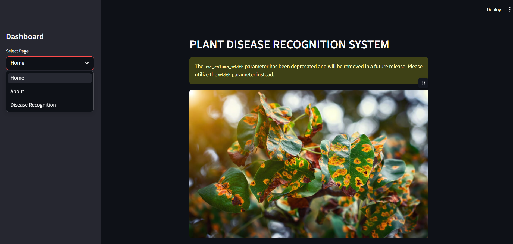
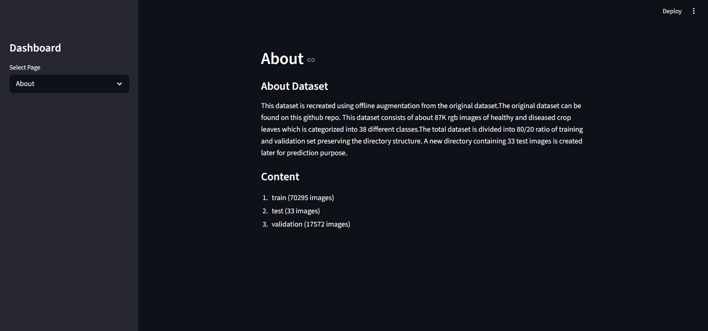
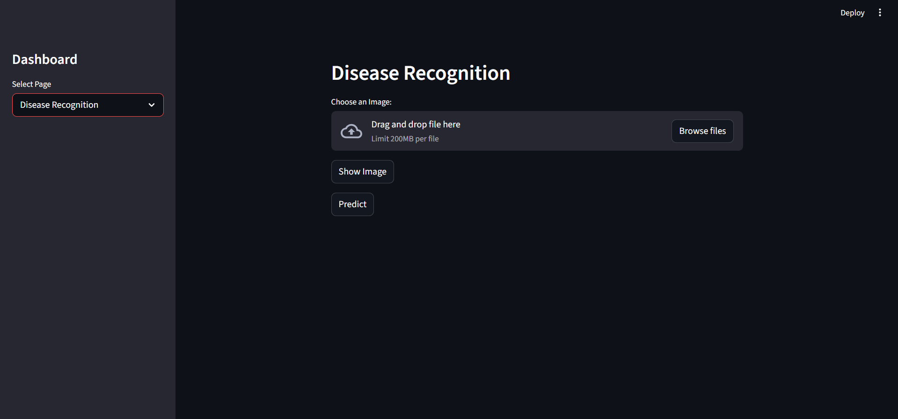

# **Plant Disease Recognition System**

## **Overview of the Project**

This is a deep learning-based web application built with Python that identifies various plant diseases from images of leaves. It uses a Convolutional Neural Network (CNN) trained on the "New Plant Diseases Dataset" to recognize 38 different classes of healthy and diseased crop leaves. The application features a streamlined dashboard built with Streamlit that allows users to upload photos and receive instant diagnostic results, helping to ensure a healthier harvest through early detection.

## **Features**

* **Real-time Disease Prediction:** Analyzes uploaded leaf images instantly using a pre-trained Keras model.  
* **Interactive Dashboard:** A clean, modern interface built using Streamlit with easy sidebar navigation.  
* **38 Class Recognition:** Detects health status for a wide range of crops including Tomato, Potato, Apple, Corn, and Grapes.  
* **High-Accuracy Model:** The underlying CNN architecture achieves approximately 95% validation accuracy.  
* **Automated Processing:** Automatically handles image resizing to 128x128 pixels and normalization for the model.  
* **Detailed Documentation:** Includes an "About" page with dataset information and project mission.

## **Technologies/Tools Used**

* **Programming Language:** Python 3.x  
* **Deep Learning Framework:**  Tensorflow (For model loading and inference)  
  * keras (For building and training the CNN)  
* **GUI/Web Framework:**  Streamlit (For the interactive web application)  
* **External Libraries:**  Numpy (For numerical arrays and image processing)  
  * matplotlib & seaborn (For training history visualization)  
  * pandas (For metadata and logging)

## **Steps to Install & Run the Project**

### **Prerequisites**

Ensure you have Python installed on your system. An active internet connection is required to install the necessary libraries via pip.

### **1\. Clone or Download the Repository**

Download the Python script (main.py) and the model file (trained_model.keras) and place them in a project folder.

### **2\. Install Dependencies**

Open your terminal or command prompt, navigate to the project folder, and install the required external Python libraries using pip:

pip install streamlit tensorflow numpy matplotlib pandas seaborn

### **3\. Prepare Project Assets**

For the application to function correctly, ensure the following files are in the **same directory** as your Python script:

* main.py  
* train.ipynb
* test.ipynb
* home_page.jpeg  

### **3\. Craete and Train the Model**

To create the mode, we need to run train.ipynb file which will create and train the model, in addition it also save training history file to track it improvement.

### **4\. Run the Project**

Open the terminal to the project file location and execute the given command:

streamlit run main.py

## **Instructions for Testing**

1\. Upon running the script, a new browser tab will open at http://localhost:8501.  
2\. From the sidebar, select the **"Disease Recognition"** page.  
3\. Click the **"Browse files"** button to upload an image of a plant leaf from your computer.  
4\. Click the **"Predict"** button to start the analysis.  
5\. The application will display the uploaded image and the predicted disease class (e.g., "Potato___Early_blight").  
6\. To test error handling, try uploading a non-leaf image; the model will still provide the closest matching class from its 38 learned categories.

## **Screenshots**

The Screenshot of User Interface.

